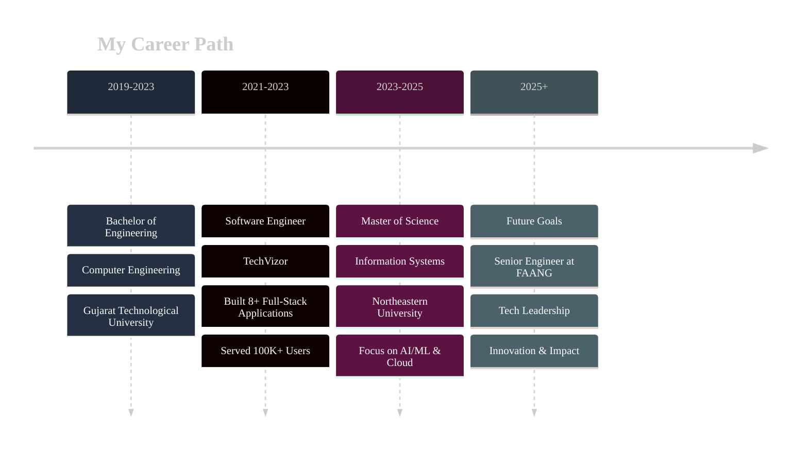

  

  
  
  

 

  

##  About Me

- 🎓 **MS in Information Systems** @ Northeastern University, Boston
- 💼 Former **Software Engineer** with 2+ years building scalable solutions
- 🔭 Currently exploring **Generative AI**, **Cloud Architecture**, and **Distributed Systems**
- 🌱 Learning **Kubernetes**, **System Design**, and **Advanced ML/AI**
- 💡 Passionate about creating impactful solutions that serve **100K+ users**
- 🎯 **Goal**: Contributing to cutting-edge projects at top tech companies

 

##  Tech Stack

<b>🔤 Languages</b>

 

  

<b>🌐 Frontend</b>

 

  

<b>⚙️ Backend & Frameworks</b>

 

  

<b>🗄️ Databases & Cloud</b>

 

  

<b>🤖 AI/ML & Data Science</b>

 

  
  
  
  
  

<b>🛠️ DevOps & Tools</b>

 

  

##  Featured Projects

  
| Project | Description | Tech Stack | Highlights |
|---------|-------------|------------|------------|
| **🚀 Parallel Deep Learning System** | Distributed training pipeline for skin disease classification across 35 classes |    | • 3.3× speedup with 84% efficiency • 91% accuracy • 245,000 images processed |
| **🌌 Space Exploration Database** | SQL Server database with 20 tables, stored procedures, and Power BI dashboards |    | • 10,000+ space records • 15+ interactive dashboards • 40% security improvement |
| **💼 MERN Job Portal** | Full-stack job platform with role-based access and secure authentication |     | • 100+ job listings • 99.9% uptime • Responsive design |
| **🤖 RAG System** | Retrieval-Augmented Generation with LangChain and GPT-3.5 |    | • 30% better accuracy • FAISS vector search • 25% faster queries |
| **📊 Walmart Sales Analysis** | Predictive analytics for sales forecasting using ML techniques |    | • 15% forecast improvement • A/B testing implementation • 25% volatility reduction |
| **🏨 Hotel Management System** | Secure hotel booking system with JWT authentication |    | • 1,000+ concurrent users • <100ms response time • 95% security improvement |

 

  

## 📊 GitHub Analytics

  
  

  

## 🏆 Achievements & Impact

  
| 🎯 Metric | 📈 Achievement |
|-----------|----------------|
| **Applications Built** | 8+ Full-Stack Solutions |
| **Users Impacted** | 100,000+ Active Users |
| **Performance Gains** | 70% Deployment Time Reduction |
| **System Reliability** | 99.95% Uptime Achieved |
| **Team Leadership** | Mentored 5+ Developers |
| **API Efficiency** | <200ms Response Times |

## 🌟 Professional Journey

### 📈 Career Highlights

| 🎯 Phase | 🏢 Organization | 💡 Key Achievements |
|----------|----------------|---------------------|
| **Education** | Gujarat Technological University | • B.E. in Computer Engineering • Strong foundation in CS fundamentals |
| **First Role** | TechVizor (Software Engineer) | • Built 8+ production applications • 70% deployment time reduction • Mentored 5+ developers |
| **Current** | Northeastern University | • MS in Information Systems • Advanced AI/ML & Cloud Computing • 3.5 GPA |
| **Next Step** | Seeking Opportunities | • Full-Stack Engineering • AI/ML Development • Cloud Architecture |

## 🤝 Let's Connect!

  
  
  
  

 

  

---

  <b>🚀 Open to exciting opportunities in Software Engineering, AI/ML, and Full-Stack Development!</b>
   
  <i>"Code is like humor. When you have to explain it, it's bad." – Cory House</i>

